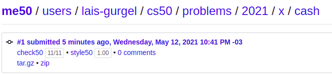

# Week 1 - C
Introduction on the programming language C
- Data types
- Operators
- Conditional Statements
- Loops
- Command Line

## Exercises

# Mario
On [Mario problem set](./exercises/mario.c) we need to create a terminal version of the famous pyramids from Super Mario World. The catch is that the pyramid must be responsive to the user inputs. He is deciding it’s height.

**10/10 100%**

# Cash
The [cash exercise](./exercises/cash.c) basically asks us to count how many coins we need to use to return a change. Here the cashier wants to use the least amount of coins possible, not mattering how many coins of each are in the cashier’s drawer.

**11/11 100%**

